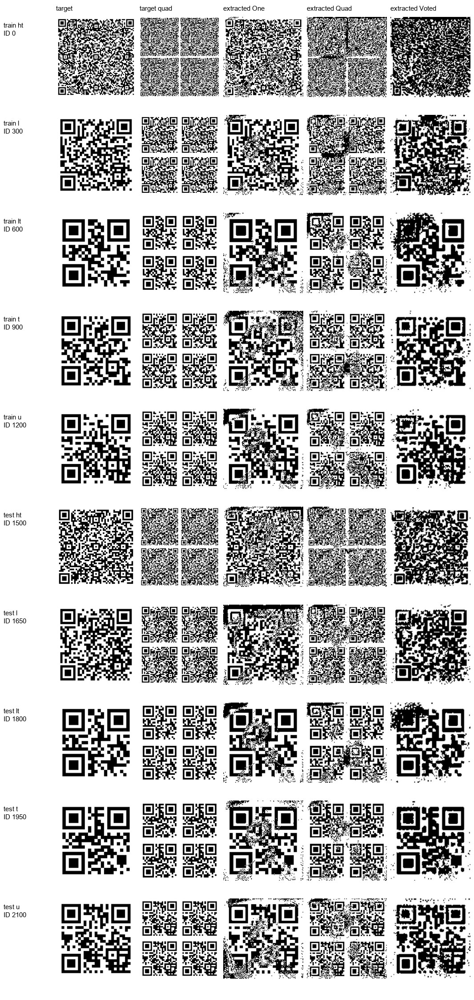

# Phase 4 QR-DN1.0 Visual Dataset Audit

**Audit scope:** read-only inspection of the extracted `data/qr_dn1.0/` images and existing dataset documentation. No dataset images or splits were changed, and no model was trained.

## Dataset structure and integrity

The five paired image folders each contain 2,250 JPEGs: 1,500 under `train/` (IDs 0–1499) and 750 under `test/` (IDs 1500–2249). Every numeric ID and split was present in all five folders. The representative contact sheet uses IDs 0, 300, 600, 900, 1200 for train and 1500, 1650, 1800, 1950, 2100 for test, spanning the five documented QR groups.

All 11,250 files across those folders decoded successfully. Every image is a 512×512 JPEG decoded by Pillow in grayscale (`L`) mode. No unreadable or invalid images were found. SHA-256 comparison found 6,900 distinct byte hashes and 150 duplicate-hash groups, containing 4,500 files in total. These are exact byte duplicates, not merely visually similar images; repeated target/reference content is expected from the dataset's repeated host-image captures. The paired IDs themselves are not unique visual content.

The additional `QR/` folder holds source QR images, not another member of the five image-pair folders audited above.

## Folder roles and visible differences

The official [QR-DN1.0 dataset record](https://data.mendeley.com/datasets/t2bdr663ms/2) describes five QR density/content groups, original non-distorted ground-truth instances, and three extraction approaches—simple, quadruple, and voted—applied after watermark embedding and real screen/camera capture. It describes the collection as distorted/noisy QR extraction data, not as fraud or tampering labels. The record gives a 512×512 image resolution and CC BY 4.0 license.

From the matched images and that documentation:

- `target/` appears to contain the clean, single-QR ground-truth reference for each ID.
- `extracted One/`, `extracted Quad/`, and `extracted Voted/` are the noisy outputs of the simple, quadruple, and voted extraction approaches, respectively. This mapping is supported by the official description and the visual forms.
- `target quad/` visibly contains a clean 2×2 arrangement of QR regions. Its name, matching IDs, and correspondence to the similarly arranged `extracted Quad/` output suggest it is the clean reference for the quadruple extraction output. The record does not explicitly document this local folder name or its construction, so that specific mapping is an image-based inference.

In the matched examples, `extracted One/` retains one large QR region but has speckle, broken/filled modules, and edge artifacts. `extracted Quad/` has four smaller QR regions with noise and local module damage in each region. `extracted Voted/` returns a single QR-like region with coarser block loss, merged modules, and speckle. These are consistent with screen/camera capture and extraction/reconstruction artifacts described by the source. `target quad/` is a four-region reference layout, not a tamper class. Visual inspection alone does not establish malicious intent or deliberate alteration.

## What the labels support

The available organization and documentation support paired image reconstruction, denoising, and image-quality/robustness evaluation: noisy extracted images can be compared with their non-distorted reference images. The five groups describe QR content/density categories, while the three output folders distinguish extraction methods. There are no genuine-versus-tampered, fraudulent-versus-authentic, or malicious-versus-benign image labels in this dataset. It therefore does **not** support supervised visual-tampering detection as labeled.

## Contact sheet

The contact sheet shows the ten matched train/test examples, with folders as columns and ID/group as rows:

Saved at `ml/reports/qr_dn1_visual_contact_sheet.png`.

## Limitations

The contact sheet is a representative visual sample, not a measurement of reconstruction quality. This audit did not decode QR payloads, calculate PSNR/SSIM or other quality metrics, inspect camera metadata, or independently verify each image's capture provenance. The source's class-level descriptions and matching IDs establish intended reference/output pairing, but the `target quad/` folder's precise generation procedure remains undocumented in the materials reviewed.
